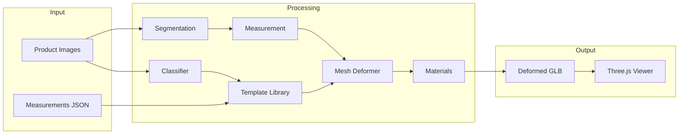

# Defirmation Architecture

## System Overview



## Template Deformation Flow

```text
3 Images → Detect measurements → Choose closest template
         → Scale vertices per part → Apply rim_pull contour fit
         → Apply PBR materials → Export GLB + anchors
```

## Named Mesh Parts

Each template GLB contains independently deformable parts:

`Frame`, `LeftLens`, `RightLens`, `Bridge`, `LeftRim`, `RightRim`, `LeftTemple`, `RightTemple`, `NosePads`, `TempleTips`

## Toolkit vs Backend

| Layer | Location | Role |
|-------|----------|------|
| Toolkit | `eyewear_vto_toolkit.py` | Stubs, dataset, calibration registry |
| Backend | `backend/` | Production deformation pipeline |
| Tuning | `deformation_tuning_api.py` | Interactive rim_pull calibration |
| Training | `train_yolov8_seg.py` | Segmentation model |

Both toolkit and backend share `templates/` directory.

## Fallback Chain

```text
Request template "cat_eye_gold"
  → cat_eye_gold.glb exists?  use it
  → else geometric_metal.glb  with cat_eye metadata
```

## Data Flow for Training

```text
Raw images + masks
  → manifest.json
  → train/val/test splits
  → YOLO polygon labels
  → YOLOv8-Seg training
  → best.pt → tuning API + segmenter
```

## Deployment Ports

| Service | Port | Command |
|---------|------|---------|
| Main VTO API | 8000 | `uvicorn backend.api.main:app` |
| Tuning UI | 8001 | `python deformation_tuning_api.py` |
| GLB Viewer | 8000/viewer | Static via main API |

## Timeline

| Week | Focus | Deliverable |
|------|-------|-------------|
| 2 | Templates | 7 stubs + geometric_metal base |
| 3 | Data | 200+ labeled masks |
| 4 | Training | YOLO mAP50 > 0.80 |
| 5 | Calibration | rim_pull per style |
| 6 | Integration | End-to-end VTO |

## Tech Stack

| Module | Library |
|--------|---------|
| Segmentation | YOLOv8-Seg |
| Image Processing | OpenCV |
| Mesh Processing | trimesh + scipy |
| GLB Export | trimesh |
| Viewer | Three.js |
| Backend | FastAPI |
